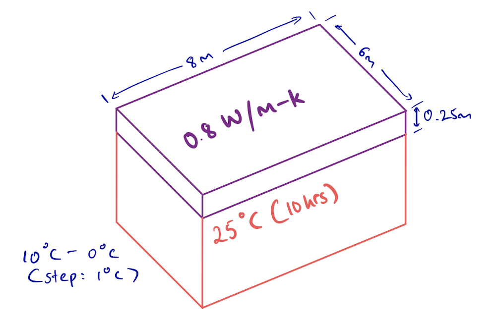
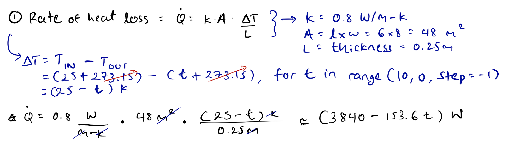
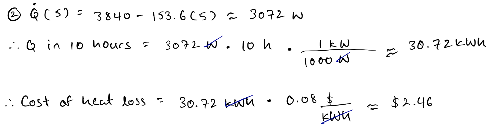
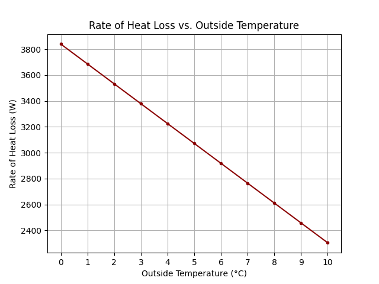

# Project 1 Report

## Overview

There is an electrically heated home, and the parameters that affect it are as following:

    

The project involves:
1. Plotting the rate of heat loss( **Q̇** ) through the roof(*depicted in purple*) as a function of the outside temperature( **10°C - 0°C** )

2. Assuming the outside temperature remains constant at **5°C**, calulcating the cost of heat loss, given that electricity is **$0.08/kWh**

---

## Setup & Calculations

1. The equation for the *rate* of heat loss through the roof is given by:

    $$
        Q̇ = \frac{k·A·ΔT}{L}
    $$

    where,
    * *k* is the thermal conductivity of the roof's material, concrete
    * *A* is the cross-sectional area of the roof
    * *ΔT* is the difference between:
        * Temperature at the inner face of the roof( **25°C** ), and 
        * Temperature at the outer face of the roof( outside temperature ) 
    * *L* is the length between the temperature points

     

    So, let's plug in the values:

    

        
    

 

2. Instead of varying from **10°C** to **0°C**, the outside temperature is at a constant **5°C**. And the given cost of heat is **$0.08/kWh**. 

    So, let's plug in the values, once again:
    
    

        
    

---

## Results & Analysis

1. Table representing the rate of heat loss as a function of outside temperature:

    | **t (°C)** |  10  | 9      | 8      | 7      | 6      | 5    | 4      | 3      | 2      | 1      | 0    |
    |:---------:|:----:|--------|--------|--------|--------|------|--------|--------|--------|--------|------|
    | **Q(t) (W)** | 2304 | 2457.6 | 2611.2 | 2764.8 | 2918.4 | 3072 | 3225.6 | 3379.2 | 3532.8 | 3686.4 | 3840 |

 

* Graph representing the rate of heat loss as a function of outside temperature:

    

        
    
 

* As expected, in accordance with the the second law of themrodynamics, an increased difference in temperature leads to an increased rate of heat loss. 

2. The cost of heat loss over the course of a constant **5°C** outer temperature was *$2.46*. According to the [U.S. Energy Information Administration](https://www.eia.gov/todayinenergy/detail.php?id=51438#:~:text=In%202021%2C%20the%20average%20nominal,our%20latest%20Electric%20Power%20Monthly.), the "average nominal retail electricity price paid by U.S. residential electric customers" in 2021 was *~$0.14*. Thus, the home owner is paying *~41.69%* less than the national average.